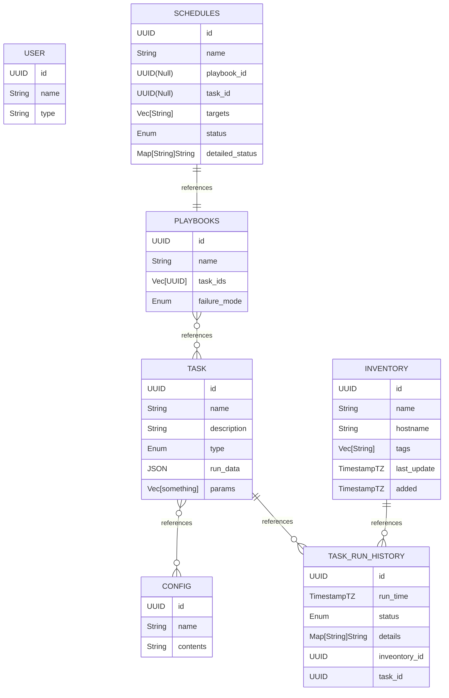

# Data Structure

## ERD

https://mermaid.js.org/syntax/entityRelationshipDiagram.html

```mermaid
erDiagram
    INVENTORY {
        UUID id
        String name
        String hostname
        Vec[String] tags
        TimestampTZ last_update
        TimestampTZ added
    }

    TASK {
        UUID id
        String name
        String description
        Enum type
        JSON run_data
        Vec[something] params
    }

    TASK_RUN_HISTORY {
        UUID id
        TimestampTZ run_time
        Enum status
        Map[String]String details
        UUID inveontory_id
        UUID task_id
    }

    USER {
        UUID id
        String name
        String type
    }

    PLAYBOOKS {
        UUID id
        String name
        Vec[UUID] task_ids
        Enum failure_mode
    }
    SCHEDULES {
        UUID id
        String name
        UUID(Null) playbook_id
        UUID(Null) task_id
        Vec[String] targets
        Enum status
        Map[String]String detailed_status
    }

    CONFIG {
        UUID id
        String name
        String contents
    }

    SCHEDULES ||--|| PLAYBOOKS : references
    PLAYBOOKS }o--o{ TASK : references
    TASK }o--o{ CONFIG : references
    TASK ||--o{ TASK_RUN_HISTORY : references
    INVENTORY ||--o{ TASK_RUN_HISTORY : references
```
